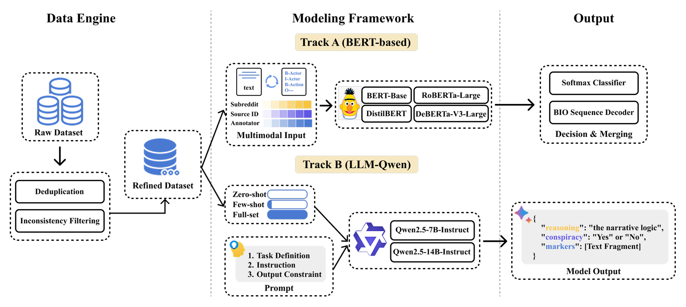
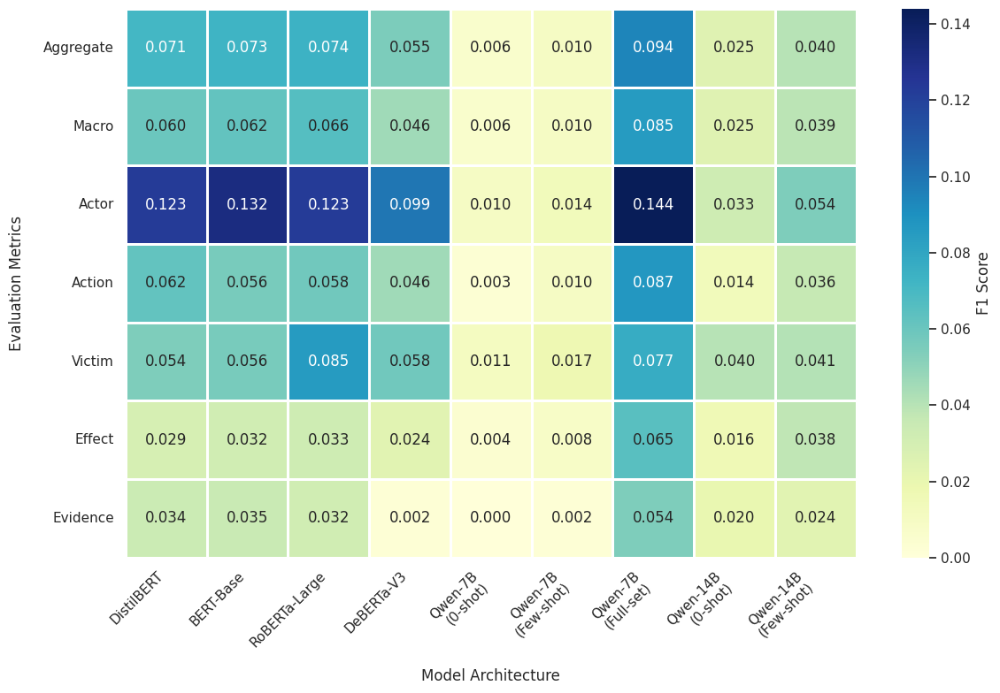
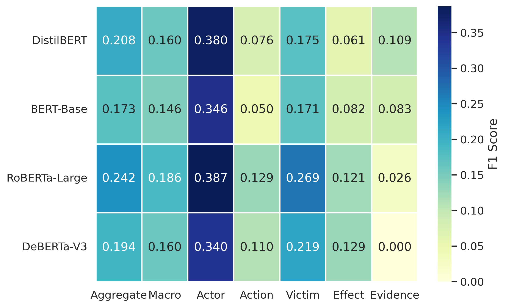

# A Dual-Track System for Conspiracy Analysis

A general conspiracy theory monitoring framework for Reddit comments ([SemEval-2026 Task 10](https://hide-ous.github.io/semeval2026-psycomark/)) integrates BERT‑based pretrained language models and large language models for conspiracy detection and psycholinguistic marker extraction, while examining the impact of model architecture and scale.

<p align="center">
  
</p>

## Dataset
The original dataset consists of 4,316 labeled training instances, along with 100 unlabeled development instances and 337 test instances. The training, development and test datasets are all placed in the dataset folder.

The distribution of the dataset after data preprocessing is shown in the following table.

| Conspiracy Label | Total Texts | with Actor  | with Action | with Effect | with Evidence | with Victim |
| :--------------- | :---------: | :---------: | :---------: | :---------: | :-----------: | :---------: |
| Can't tell       |     588     |  424 (72%)  |  407 (69%)  |  288 (49%)  |   331 (56%)   |  252 (43%)  |
| No               |    1,541    |  963 (62%)  |  955 (62%)  |  791 (51%)  |   726 (47%)   |  582 (38%)  |
| Yes              |    1,108    | 1,015 (92%) | 1,019 (92%) |  857 (77%)  |   824 (74%)   |  755 (68%)  |
| Total            |    3,237    | 2,402 (74%) | 2,381 (74%) | 1,936 (60%) |  1,881 (58%)  | 1,589 (49%) |

## Method
This study proposes a conspiracy analysis framework, using BERT-based PLMs and LLMs, designed to identify conspiracy content in unstructured social media text and extract critical psychological markers.

 

## Result
The experimental results reveal the performance between discriminative and generative architectures.
### 1. Conspiracy Detection

| **Model**                   | **Acc.** | **W-F1** | **F1 (No)** | **F1 (Yes)** |
| --------------------------- | -------- | -------- | ----------- | ------------ |
| DistilBERT                  | 0.72     | 0.72     | 0.75        | 0.67         |
| BERT-Base                   | 0.70     | 0.71     | 0.75        | 0.66         |
| RoBERTa-Large               | 0.74     | 0.74     | 0.76        | 0.71         |
| **DeBERTa-V3-Large**        | **0.76** | **0.76** | **0.80**    | **0.71**     |
| Qwen2.5-7B (Zero-shot)      | 0.66     | 0.59     | 0.78        | 0.31         |
| Qwen2.5-7B (Few-shot)       | 0.66     | 0.59     | 0.77        | 0.32         |
| Qwen2.5-7B (Full-shot)      | 0.79     | 0.79     | 0.83        | 0.73         |
| Qwen2.5-14B (Zero-shot)     | 0.73     | 0.72     | 0.79        | 0.62         |
| Qwen2.5-14B (Few-shot)      | 0.77     | 0.76     | 0.82        | 0.68         |
| **Qwen2.5-14B (Full-shot)** | **0.80** | **0.80** | **0.84**    | **0.76**     |

### 2. Conspiracy Marker Extraction

 

### 3. Results on Development Set
The following table and image present the detailed performance metrics for Bert-based models on the development set.

**1.Conspiracy detection**

| Model         | Accuracy | Weighted F1 | F1 Score (No) | F1 Score (Yes) |
| :------------ | :------: | :---------: | :-----------: | :------------: |
| DistilBERT    |  0.8052  |   0.8023    |    0.8544     |     0.7059     |
| BERT-Base     |  0.7922  |   0.7879    |    0.8462     |     0.6800     |
| RoBERTa-Large |  0.7662  |   0.7680    |    0.8163     |     0.6786     |
| DeBERTa-V3    |  0.7662  |   0.7614    |    0.8269     |     0.6400     |

 **2.Conspiracy marker extraction**

 
 
## Getting Started
### Setup

```
pip install -r requirements_V2.txt  #Install dependencies
```

### Usage and Run
#### Track A BERT-based

```
cd "Bert-based track"  #Navigate into the folder to execute scripts

# 1. Conspiracy detection 
python train_binary.py 
python infer_binary.py 
# 2. Psycholinguistic markers extraction 
python train_one_span.py 
python infer_one_span.py 

```
#### Track B LLMs
Execute the following commands in your terminal. Before running, replace the placeholders (e.g., `<MODEL_ID>`) with your specific paths or identifiers according to the table below.
```
cd "LLMs track"  #Navigate into the folder to execute scripts

# Step 1: Training
python train.py \
    --model_path "<MODEL_ID>" \
    --train_file "<TRAIN_FILE>" \
    --output_dir "<OUTPUT_DIR>"

# Step 2: Inference
# Ensure --adapter_path matches the --output_dir used in Step 1
python infer.py \
    --model_path "<MODEL_ID>" \
    --model_alias "<ALIAS>" \
    --stage C \
    --adapter_path "<OUTPUT_DIR>" \
    --test_binary_file "<TEST_BINARY_FILE>" \
    --test_span_file "<TEST_SPAN_FILE>" \
    --train_file "<TRAIN_FILE>"
```

**Parameter**

| Name                 | Description                                      |
| -------------------- | ------------------------------------------------ |
| `<MODEL_ID>`         | Hugging Face repository ID                       |
| `<TRAIN_FILE>`       | Training data path                               |
| `<OUTPUT_DIR>`       | Output path                                      |
| `<ALIAS>`            | A name to identify your specific run             |
| `<TEST_BINARY_FILE>` | Dataset used for evaluating conspiracy detection |
| `<TEST_SPAN_FILE>`   | Dataset used for evaluating marker extraction    |

## File structure
```
.
├── README.md
├── assets/                    # Documentation images
├── Bert-based track/          # Traditional Transformer models (BERT, RoBERTa, etc.)
│   ├── train_binary.py        # Fine-tuning for Conspiracy detection 
│   ├── infer_binary.py        # Inference for conspiracy detection
│   ├── train_one_span.py      # Psycholinguistic markers extraction 
│   └── infer_one_span.py      # Inference for marker extraction
├── Data/                      # Dataset 
│   ├── dev_rehydrated.jsonl
│   ├── train_cleaned_final.jsonl
│   ├── test_binary_rehydrated.jsonl
│   └── test_span_rehydrated.jsonl
├── LLMs track/                # LLMs
│   ├── train.py               # LoRA fine-tuning 
│   ├── infer.py               # Multi-stage inference (Zero-shot/Few-shot/Fine-tuned)
│   └── utils.py               # Shared prompt templates 
├── output/                    # Output folder 
│   ├── binary/                
│   │   └── models/            
│   ├── span/                 
│   │   └── models/            
│   └── submissions/           
├── data_preprocess.py         # Initial data cleaning
└── requirements.txt           # Project dependencies
```


